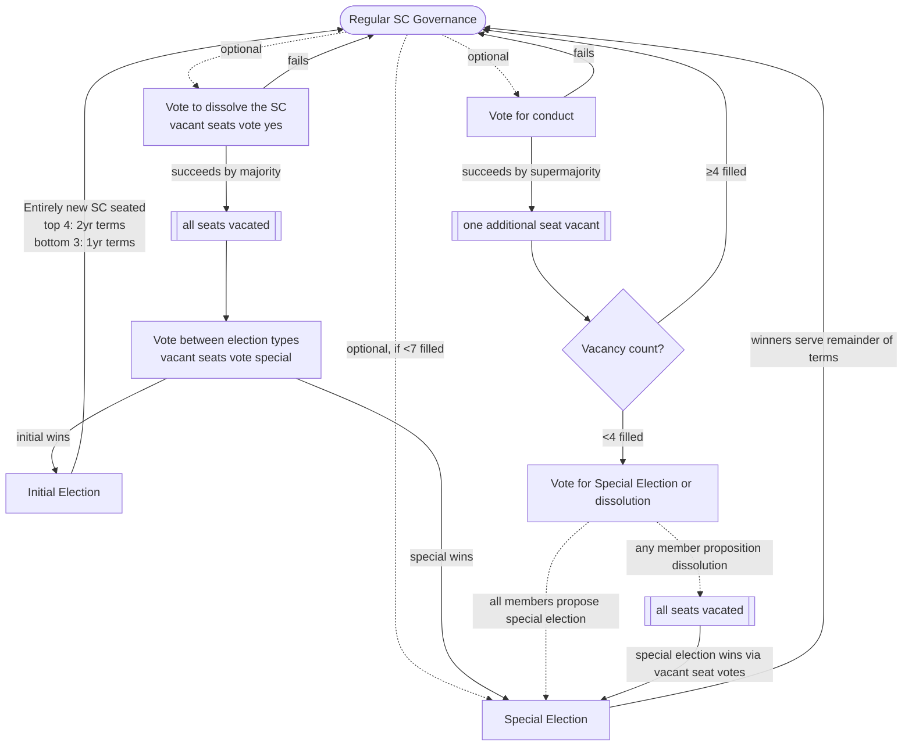

# Constitution Commentary

This document contains a non-normative, non-binding commentary on the constitution, explaining some subtleties.

## SC Election, Removal, and Dissolution procedure

The state machine of these portions of the constitution is especially complex.

These interactions are of special note:

- When less than half of the seats are filled, if any SC member proposes a no confidence vote, the vote will automatically win due to how vacant seats are counted for dissolution votes.
  However if the SC does not hold such vote, and is thus unanimous in choosing to hold a special election for the currently-vacant seats only instead, such a special election will proceed.

- It is only possible to follow a dissolution with an initial election when more than half of the SC seats were full prior to dissolution.

- Vacant seats not triggering a dissolution vote makes it possible for the vacancy procedure for when less than half of the seats are filled to resolve the situation without dissolution.

- After a removal has occurred, it is possible to hold a special election to fill the vacant seat.

The following flow chart diagrams the procedure, hopfully making these interactions explicit:

